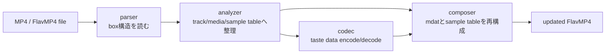
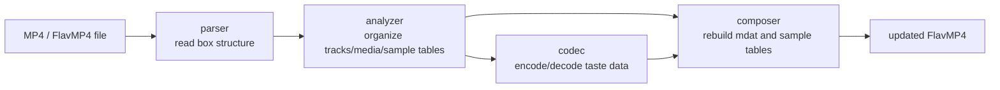

# flavtool

## 日本語

`flavtool` は、味覚情報を記録できる FlavMP4 を解析・編集・再構成するための低レベル Python ツールキットです。MP4 の box 構造を読み、トラック情報を整理し、味データを encode/decode し、必要に応じて MP4 を再合成します。

TasteColorizer のように、既存の映像メディアへ推定された味データを付与する用途の基盤になります。

参考: https://www.honma.site/ja/works/TasteColorizer/

### 処理の流れ



`flavtool` は、MP4 の box 構造を直接扱うための低レベル層です。アプリケーションから簡単に読み書きしたい場合は、上位 API の `flavpy` を使います。

### インストール

```bash
pip install flavtool
```

ローカルで開発する場合:

```bash
pip install -e .
```

### 主なモジュール

- `parser`: MP4 box 構造の解析
- `analyzer`: 解析結果からトラックやメディア情報を整理
- `codec`: 味データの encode/decode
- `composer`: 解析・編集した情報から MP4 を再構成

### MP4 を解析する

```python
from flavtool.parser import Parser

parser = Parser("path/to/file.mp4")
box = parser.parse(read_mdat_bytes=False)
box.print()
```

`read_mdat_bytes=False` にすると、メディア本体をメモリに読み込まずに構造を確認できます。

`mdat` まで含めて読みたい場合:

```python
from flavtool.parser import Parser

parser = Parser("path/to/file.mp4")
box = parser.parse(read_mdat_bytes=True)
```

### トラックを解析する

```python
from flavtool.analyzer import analyze
from flavtool.parser import Parser

parser = Parser("path/to/file.mp4")
box = parser.parse(read_mdat_bytes=False)
flav_mp4 = analyze(box)

taste_track = flav_mp4.tracks["tast"]
```

track や media data は media type ごとに管理されます。

```python
for media_type, track in flav_mp4.tracks.items():
    if track is not None:
        print(media_type, track.media.header.duration)

taste_media_data = flav_mp4.media_datas["tast"]
```

### 味データを encode/decode する

```python
import numpy as np
from flavtool.codec import get_decoder, get_encoder

taste = np.array([1, 2, 3, 4, 5], dtype=np.uint8)

encoder = get_encoder("raw5")
encoded = encoder(taste)

decoder = get_decoder("raw5")
decoded = decoder(encoded)
```

`raw5` は 5 次元の `uint8` 味データをそのまま bytes にします。`rmix` は zlib 圧縮を使う codec です。

### composer で再構成する

`Composer` は `FlavMP4` の track と media data をもとに `mdat` と sample table の offset を再構成し、ファイルへ書き出します。

```python
from flavtool.parser import Parser
from flavtool.analyzer import analyze
from flavtool.composer import Composer

parsed = Parser("input.mp4").parse()
flav_mp4 = analyze(parsed)

composer = Composer(flav_mp4)
composer.compose()
composer.write("output.mp4")
```

通常は `flavpy.FlavWriter` が composer まわりを隠蔽します。MP4 box や sample table を直接操作したい場合に `flavtool` を使います。

### 構成

- `flavtool/parser/`: MP4 parser
- `flavtool/analyzer/`: track/media analyzer
- `flavtool/codec/`: taste codec
- `flavtool/composer/`: MP4 composer
- `main.py`, `vit_test.py`: ローカル実験用コード
- `*.mp4`: サンプルまたは生成されたメディアファイル

## English

`flavtool` is a low-level Python toolkit for parsing, analyzing, editing, encoding, and composing FlavMP4 files.

It is the lower layer used when applications need direct access to MP4 structures, taste tracks, codecs, and composition.

Reference: https://www.honma.site/ja/works/TasteColorizer/

### Processing Flow



`flavtool` is the low-level layer for working directly with MP4 boxes and FlavMP4 structures. Use `flavpy` when you want simpler application-facing read/write APIs.

### Install

```bash
pip install flavtool
```

For local development:

```bash
pip install -e .
```

### Modules

- `parser`: parse MP4 box structures
- `analyzer`: organize parsed boxes into tracks and media information
- `codec`: encode/decode taste data
- `composer`: rebuild MP4 data

### Parse an MP4

```python
from flavtool.parser import Parser

parser = Parser("path/to/file.mp4")
box = parser.parse(read_mdat_bytes=False)
box.print()
```

Read `mdat` payloads as well:

```python
from flavtool.parser import Parser

parser = Parser("path/to/file.mp4")
box = parser.parse(read_mdat_bytes=True)
```

### Analyze Tracks

```python
from flavtool.analyzer import analyze
from flavtool.parser import Parser

parser = Parser("path/to/file.mp4")
box = parser.parse(read_mdat_bytes=False)
flav_mp4 = analyze(box)

taste_track = flav_mp4.tracks["tast"]
```

Inspect available tracks and media data:

```python
for media_type, track in flav_mp4.tracks.items():
    if track is not None:
        print(media_type, track.media.header.duration)

taste_media_data = flav_mp4.media_datas["tast"]
```

### Encode and Decode Taste Data

```python
import numpy as np
from flavtool.codec import get_decoder, get_encoder

taste = np.array([1, 2, 3, 4, 5], dtype=np.uint8)

encoder = get_encoder("raw5")
encoded = encoder(taste)

decoder = get_decoder("raw5")
decoded = decoder(encoded)
```

`raw5` stores a 5-dimensional `uint8` taste vector directly as bytes. `rmix` uses zlib compression.

### Compose an MP4

```python
from flavtool.parser import Parser
from flavtool.analyzer import analyze
from flavtool.composer import Composer

parsed = Parser("input.mp4").parse()
flav_mp4 = analyze(parsed)

composer = Composer(flav_mp4)
composer.compose()
composer.write("output.mp4")
```

In normal application code, `flavpy.FlavWriter` hides most composer details. Use `flavtool` directly when you need to inspect or modify MP4 boxes, tracks, sample tables, or media data.
